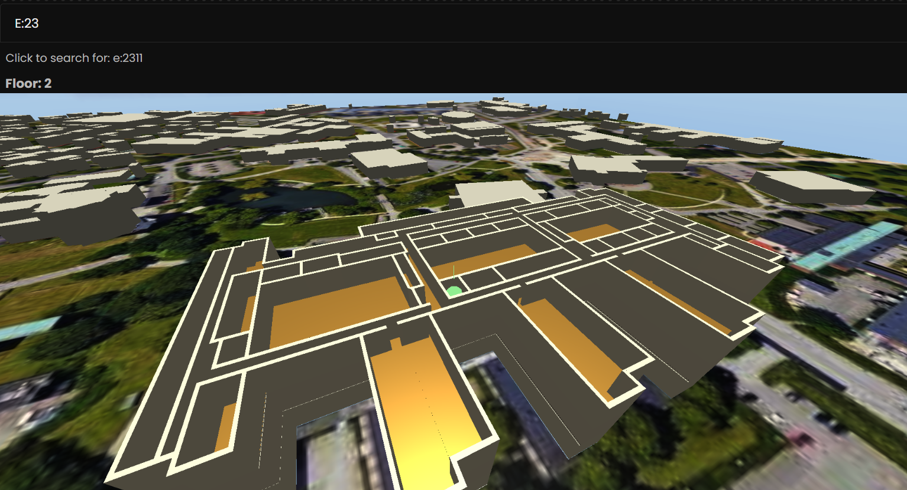

# Karta över E-huset

### Three.js
* Notera att projektet använder Three.js som är ett javascript bibliotek för 3D grafik. Bibloteket (en folder) är inte inkluderat i projektet på github, och måste därför kopplas till projektet efter pull från github. Den primitiva lätta lösning att göra detta är att laddas ner three.js och läggas i samma mapp som projektet - men det finns antagligen betydligt bättre lösningar.

### Rekomendation till Dsek:
* Ändra färgen på blender modellerna så de passar hemsidan bättre!

### Hög prio to-do
* Projektet innehåller många filer (huvudsakligen modeller)
* Lägg till 4115-4124
* Lägg till 24xx salarna
* Fixa outlines på byggnaden, så att det är tydligare
* K2, 1123 är på fel plats?
* Man ska kunna söka efter en vånning
* Fixa något snyggare än en ful skymap

### Låg prio to-do
* Lägg till toaletter
* Lägg till smårummen (grupprummen)
* Ta bort E:
  * DVS man ska kunna enbart skriva 1147, istället för E:1147
* Visa rummen på ett snyggare sätt än en boll
  * Exempelvist hela rummet blir grönt
* Skaffa elevation på bakgrunden, förslagsvist genom att anpassa markens elevation i blender med hjälp av data från opensourcemaps.org
* Fixa (ofarliga) errors som ges
* Bättre autokorrektur

